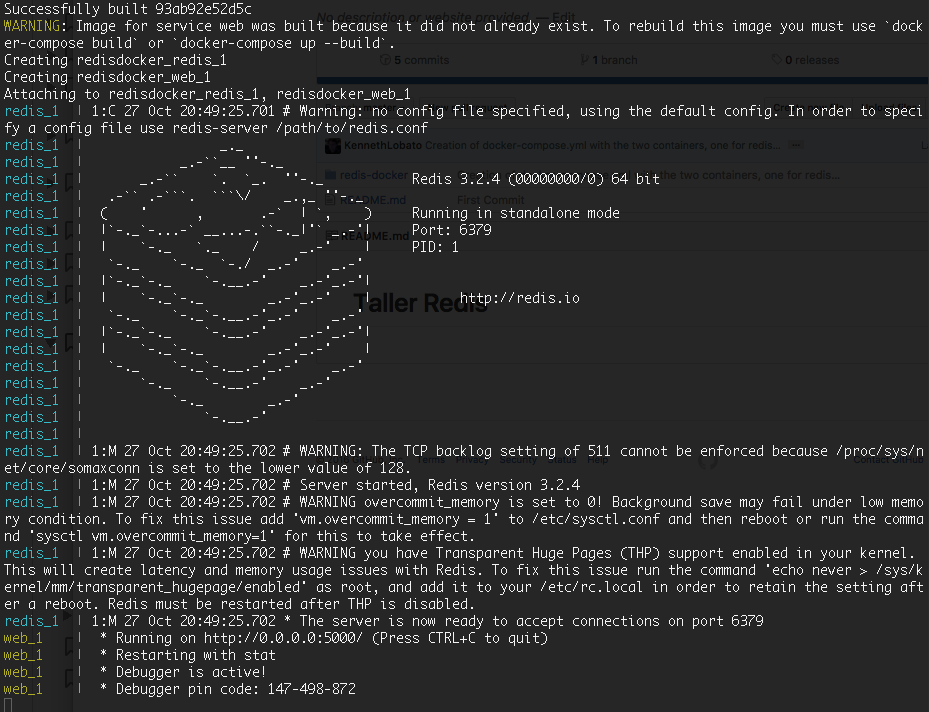
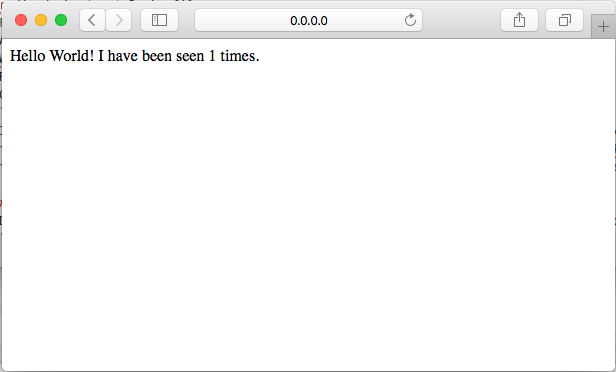
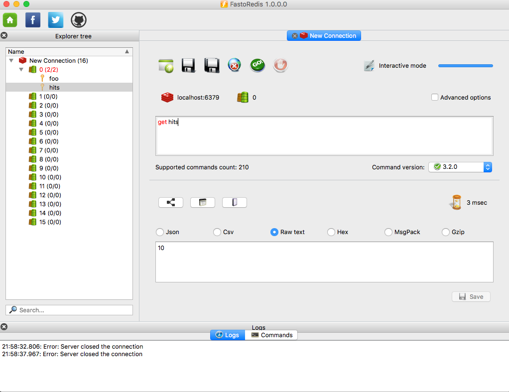

# Taller Redis
***

## Index:
1. [Prerequisites](#prerequisites)
2. [Redis in Docker](#docker)
  2.1. [Python App](#python)
  2.2. [Requirements](#requirements)
  2.3. [Dockerfile](#dockerfile)
  2.4. [Docker Compose](#dockercompose)
  2.5. [Browse the Web Service](#browse)
  2.6. [Internal view of Redis](#fastoredis)
3. [Redis in Vagrant](#vagrant)
  3.1. [Machine Preparation] (#vagrantprep)
4. [Redis Commands](http://redis.io/commands).

### 1. Prerequisites <a name="prerequisites"></a>
Ensure that you have installed the following software according to your operating system:
- [Git](https://git-scm.com/)
- [VirtualBox](https://www.virtualbox.org/)
- [Vagrant](https://www.vagrantup.com/)
- [Docker](https://www.docker.com/)
- [Fastoredis](http://fastoredis.com/)

Clone this repository and change to the created directory:
```Bash
$ git clone https://github.com/KennethLobato/tallerredis1.git
$ cd tallerredis1
```

### 2. Redis in Docker <a name="docker"></a>

Docker is an application that simulates in small containers complete virtual operating systems. This allows to run several of them running as processes of the corresponding operating system, which internally simulates/virtualizates a complete independent operating system.

With this practice we're going to deploy a very simple application using redis with two containers.

#### 2.1 Python App <a name="python"></a>
Let's take a look to *app.py*:

```Python
from flask import Flask
from redis import Redis

app = Flask(__name__)
redis = Redis(host='redis', port=6379)

@app.route('/')
def hello():
    redis.incr('hits')
    return 'Hello World! I have been seen %s times.' % redis.get('hits')

if __name__ == "__main__":
    app.run(host="0.0.0.0", debug=True)
```
This application basically runs by means of *Flask* library a web service at port 5000 (default). Every HTTP request to this port will be routed to the *hello()* function. This function increments the value of the key ***hits*** in one unit. After making the increment, shows a message with the current value.

#### 2.2 Requirements <a name="requirements"></a>
This file represents the python dependencies that have to be installed in any environment to run previously shown *app.py*
```Bash
redis-docker $ cat requirements.txt
flask
redis
```

#### 2.3 Dockerfile <a name="dockerfile"></a>
```Bash
redis-docker $ cat Dockerfile
FROM python:2.7
ADD . /code
WORKDIR /code
RUN pip install -r requirements.txt
CMD python app.py
```
This file creates the container for the previous application in python. Basically it requires to start from the Python 2.7 image (already existing and provided by Docker Hub). Adds the current folder as main source of code, mapping this folder to the */code* inside the container. Finally, it runs *pip* command to install required python packages, and launch the python application.

#### 2.4 Docker Compose <a name="dockercompose"></a>
Let's take a look to the docker-compose file.
```Bash
redis-docker $ cat docker-compose.yml
version: '2'
services:
    web:
        build: .
        ports:
         - "5000:5000"
        volumes:
         - .:/code
        depends_on:
         - redis
    redis:
        image: redis
        ports:
         - "6379:6379"
```
Docker Compose mainly provides functionalities to manage and launch in a specific order different images or containers. It also setups several configurations, like the TCP/UDP ports that will be redirected to our local machines.

Commands to manipulate docker-compose:
- Launch containers with docker-compose:
```Bash
redis-docker $ docker-compose up
```
The results should be similar to the following image.

- Launch containers in background:
```Bash
redis-docker $ docker-compose up -d
```
- See the containers that are running:

```Bash
redis-docker $ docker-compose ps
Name                      Command               State           Ports          
-------------------------------------------------------------------------------------
redisdocker_redis_1   docker-entrypoint.sh redis ...   Up      0.0.0.0:6379->6379/tcp
redisdocker_web_1     /bin/sh -c python app.py         Up      0.0.0.0:5000->5000/tcp
```
- Stop the containers:
```Bash
redis-docker $ docker-compose stop
Stopping redisdocker_web_1 ... done
Stopping redisdocker_redis_1 ... done
```
- Destroy the containers:
```Bash
redis-docker $ docker-compose rm
Are you sure? [yN] y
Removing redisdocker_web_1 ... done
Removing redisdocker_redis_1 ... done
```

#### 2.5 Browse the Web Service <a name="browse"></a>
Open in a browser the following address http://0.0.0.0:5000 or http://127.0.0.1:5000. Each request will make *hits* value to increase.



#### 2.6 Internal view of Redis <a name="fastoredis"></a>
Launch FastoRedis application and configure the connection to *localhost* and port *6379*.



### 3. Vagrant <a name="vagrant"></a>
With this exercise we are going to configure a cluster with two machines in a master-slave configuration for redis.

#### 3.1 Machine Preparation <a name="vagrantprep"></a>
1. Launch the local machines creation.
```Bash
redis-docker $ cd ../redis-vagrant
redis-vagrant $ vagrant up
```
This sentences will create two machines with names *ubuntu1* and *ubuntu2* with Ubuntu 14.04.

2. Connect with SSH in separate terminals (cmd or shells) to both machines:
```Bash
redis-vagrant $ vagrant ssh ubuntu1
```
```Bash
redis-vagrant $ vagrant ssh ubuntu2
```
3. Install the redis server in both machines using the following commands:
```Bash
vagrant@ubuntuX:~$ sudo add-apt-repository ppa:chris-lea/redis-server -y
vagrant@ubuntuX:~$ sudo apt-get -y install redis-server
```
4. Benchmark the installed redis in both machines:
```Bash
vagrant@ubuntu1:~$ redis-benchmark -q -n 1000 -c 10 -P 5
PING_INLINE: 142857.14 requests per second
PING_BULK: 166666.67 requests per second
SET: 124999.99 requests per second
GET: 200000.00 requests per second
INCR: 200000.00 requests per second
LPUSH: 142857.14 requests per second
LPOP: 166666.67 requests per second
SADD: 200000.00 requests per second
SPOP: 249999.98 requests per second
LPUSH (needed to benchmark LRANGE): 166666.67 requests per second
LRANGE_100 (first 100 elements): 100000.00 requests per second
LRANGE_300 (first 300 elements): 25641.03 requests per second
LRANGE_500 (first 450 elements): 14084.51 requests per second
LRANGE_600 (first 600 elements): 9523.81 requests per second
MSET (10 keys): 124999.99 requests per second
```
The command ask for 1000 requests, 10 running parallel connections, and generate a pipeline of 5 requests.

#### 3.2 Master Configuration <a name="masterconf"></a>
```Bash
vagrant@ubuntu1:~$ sudo tar -zxvf /vagrant/shared/redis-master.tar.gz -C /etc/
redis/
redis/sentinel.conf
redis/redis.conf
vagrant@ubuntu1:~$ sudo service redis-server restart
Stopping redis-server: redis-server.
Starting redis-server: redis-server.
```
#### 3.3 Slave Configuration <a name="slaveconf"></a>
```Bash
vagrant@ubuntu2:~$ sudo tar -zxvf /vagrant/shared/redis-slave.tar.gz -C /etc/
redis/
redis/sentinel.conf
redis/redis.conf
vagrant@ubuntu2:~$ sudo service redis-server restart
Stopping redis-server: redis-server.
Starting redis-server: redis-server.
```

#### 3.3 Test Redis <a name="testredis"></a>
To test the environment you can connect to from the slave machine to Redis:
```Bash
vagrant@ubuntu2:~$ redis-cli -h 127.0.0.1 -p 6379
127.0.0.1:6379> AUTH master2016
OK
127.0.0.1:6379> INFO
(...)
# Replication
role:slave
master_host:ubuntu1
master_port:6379
master_link_status:up
master_last_io_seconds_ago:3
master_sync_in_progress:0
slave_repl_offset:155
slave_priority:100
slave_read_only:1
connected_slaves:0
master_repl_offset:0
repl_backlog_active:0
repl_backlog_size:1048576
repl_backlog_first_byte_offset:0
repl_backlog_histlen:0
(...)
```

#### 3.4 Promote Slave to Master <a name="promoteslave"></a>
To promote a slave to be the master do the following in the last redis session:
```Bash
127.0.0.1:6379> SLAVEOF NO ONE
OK
127.0.0.1:6379> INFO
# Replication
(...)
role:master
connected_slaves:0
master_repl_offset:449
repl_backlog_active:0
repl_backlog_size:1048576
repl_backlog_first_byte_offset:0
repl_backlog_histlen:0
(...)
```
**If you have more slaves and initiated manually this process, you have to poing all of them to the new master by using command "*SLAVEOF hostname port*" **
